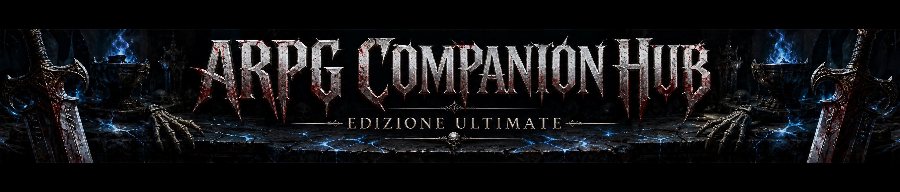

  

# ⚔️ ARPG Companion Hub - Edizione Ultimate

Benvenuto nell'**ARPG Companion Hub**, lo strumento definitivo e all-in-one dedicato agli appassionati di Action RPG. Costruito su misura per la community **I Masochist**, questo hub centralizza guide offline, tier list dinamiche, tool di terze parti e salvataggi in cloud per i tuoi titoli preferiti.

---

## 🚀 Caratteristiche Principali

* **💾 Cloud Save Integrato (Firebase):** Salva le tue build preferite e sincronizzale su qualsiasi PC o smartphone tramite l'accesso sicuro con Google o Email/Password. Le regole di sicurezza garantiscono che ogni utente veda solo i propri dati.
* **📊 Top 10 ARPG Trend Live:** Statistiche e trend dinamici sui giocatori dei principali titoli ARPG in circolazione.
* **📰 News Ticker Avanzato:** Resta sempre aggiornato con le ultime patch notes, rumors e novità della community specifiche per ogni gioco.
* **🔗 Smart Links per le Build:** Dì addio ai link rotti (Error 404). Il generatore crea ricerche mirate su YouTube e Google per trovare sempre la versione aggiornata di una build.
* **🌗 Temi e Accessibilità:** Scegli tra Tema Scuro, Tema Chiaro e Tema AMOLED (per schermi OLED). Regola istantaneamente la dimensione dei caratteri.
* **🌍 Supporto Multilingua Integrato:** Traduzione istantanea di guide e interfacce tramite il widget Google Translate.
* **🖥️ Overlay Strumenti (iFrame):** Apri tool esterni (come *Path of Building Web*) direttamente in una finestra a comparsa sopra l'Hub, senza cambiare pagina.

---

## 🎮 Titoli Supportati

L'Hub offre dashboard dedicate, barre di ricerca multi-sito e guide esclusive "offline-style" per:

1. **Path of Exile 1** (Database Unici da Leveling, Guida al Crafting Base, Guida al Trial of Ascendancy)
2. **Path of Exile 2** (Database Unici da Leveling, Guida alle Meccaniche Base e Dodge Roll)
3. **Last Epoch** (Guida Completa alla Forgiatura e ai Glifi)
4. **Diablo 2: Resurrected** (Database visivo interattivo delle Parole Runiche, Guida al Mercenario dell'Atto 2)

---

## 🛠️ Tecnologie Utilizzate

* **Frontend:** HTML5, CSS3, Vanilla JavaScript (Zero framework per la massima velocità di caricamento)
* **Backend & Auth:** Firebase (Authentication & Firestore Database)
* **Hosting:** GitHub Pages
* **Altro:** Google Translate API

---

## 🌐 Come Usarlo

Non è richiesta alcuna installazione! Vai al link della pagina ospitata tramite GitHub Pages, seleziona il tuo ARPG preferito e inizia a salvare le tue build.

---

    
  <b>Sviluppato da Sairiin (2026).</b> 
  Unisciti alla nostra community su Discord: <a href="https://discord.gg/wqywvBx"><b>I Masochist</b></a> 
  <i>Per supporto, suggerimenti o bug report: <a href="mailto:giordani.claudio@gmail.com">Contattami</a></i>

